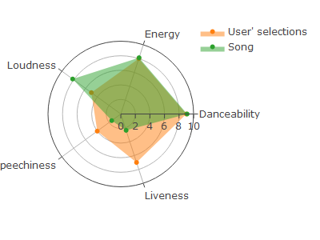

PTDS_Spotify
================

# Spotify 

<!-- badges: start -->

[](https://github.com/yt0726/ptds_final_project/actions/workflows/R-CMD-check.yaml)
<!-- badges: end -->

The goal of Spotify is to find the user’s favorite music list. It allows
you select features you care more about and their corresponding levels.
The Spotify would give two recommendation lists which are as match as
possible to your selections. One of the lists is obtained by cosine
similarity algorithm.

## Installation

You can install the development version of Spotify from
[GitHub](https://github.com/) with:

``` r
# install.packages("devtools")
devtools::install_github("yt0726/ptds_final_project")
```

## Usage

**Run application**

To run the application, you could run this code to start-up the program.
You would see the pop-up window of the application, then you could input
your preference following the instructions on the first page
`Introduction`. When you only run this application, you do not need to
have any data. There is a data set obtained from Spotify that contains
106,943 observation (music).

``` r
Spotify::Spotify_gui()
```

Here is the link of screencast for running APP:

<a href="https://youtu.be/81jgy23Xsr0" width="100%"></a>

**Run scoring function**

Here is to simulate the output obtained by your selections. If you
choose music’s genre is: Funk, and you care about Danceability, Energy,
Loudness, Speechiness, Liveness, and you set the corresponding levels
are 9,8,5,4,7, you will get the list similar to the table below. Of
course, you could use this function individually, and transmit input
like the example.

``` r
example <- Spotify_scoring(genres="Funk",
                features=c("Danceability","Energy","Loudness","Speechiness","Liveness"),
                levels = c(9,8,5,4,7))
knitr::kable(example$result)
```

|     | Artists                                                           | Track_name                            | Track_genre | Danceability | Energy | Loudness | Speechiness | Liveness |  score_1 | score_2 |  score_3 |  score_4 | score_5 | final_score |
|:----|:------------------------------------------------------------------|:--------------------------------------|:------------|-------------:|-------:|---------:|------------:|---------:|---------:|--------:|---------:|---------:|--------:|------------:|
| 437 | DJ Ghost Floripa                                                  | Mega Funk Reload Vuk Vuk              | Funk        |     9.106599 |   8.13 | 8.175647 |   1.5440415 |     2.36 | 9.893401 |    9.87 | 6.824353 | 7.544041 |    5.36 |    8.287794 |
| 707 | Wilson Pickett                                                    | Let Me Know                           | Funk        |     8.395939 |   7.29 | 7.289089 |   1.3782383 |     6.35 | 9.395939 |    9.29 | 7.710911 | 7.378238 |    9.35 |    8.253889 |
| 269 | James Brown                                                       | Get Up Offa That Thing                | Funk        |     8.395939 |   7.76 | 7.776483 |   3.6787565 |     5.45 | 9.395939 |    9.76 | 7.223517 | 9.678757 |    8.45 |    8.252785 |
| 805 | Snoop Dogg;The Doors                                              | Riders On The Storm - Fredwreck Remix | Funk        |     8.913706 |   7.86 | 8.186375 |   1.5751295 |     1.22 | 9.913706 |    9.86 | 6.813625 | 7.575130 |    4.22 |    8.237648 |
| 265 | George Benson                                                     | Give Me the Night (Single Version)    | Funk        |     8.548223 |   8.01 | 7.976250 |   0.6331606 |     3.87 | 9.548223 |    9.99 | 7.023750 | 6.633161 |    6.87 |    8.235506 |
| 464 | Snoop Dogg;Surjeet Singh;Akshay Kumar;Kuldeep Ral;Manjeet Ral;RDB | Singh Is Kinng - Title Song           | Funk        |     9.035533 |   8.13 | 8.337125 |   0.7761658 |     1.24 | 9.964467 |    9.87 | 6.662875 | 6.776166 |    4.24 |    8.235426 |
| 294 | Kyan                                                              | Mandrake                              | Funk        |     8.974619 |   7.70 | 8.328617 |   2.3937824 |     1.07 | 9.974619 |    9.70 | 6.671383 | 8.393782 |    4.07 |    8.215455 |
| 103 | 2Pac;Big Syke                                                     | All Eyez On Me (ft. Big Syke)         | Funk        |     8.852792 |   7.23 | 8.057821 |   2.5595855 |     3.27 | 9.852792 |    9.23 | 6.942179 | 8.559586 |    6.27 |    8.212819 |
| 688 | MC Marks;Mc Davi;Mc Don Juan                                      | Ela Tá Tá Tá                          | Funk        |     8.903553 |   7.21 | 7.970886 |   0.4818653 |     2.85 | 9.903553 |    9.21 | 7.029114 | 6.481865 |    5.85 |    8.205462 |
| 625 | MC Teteu;JC NO BEAT;DJ F7                                         | Ta Com Saudade de Mim                 | Funk        |     8.883249 |   7.75 | 8.106653 |   0.5709845 |     1.07 | 9.883249 |    9.75 | 6.893347 | 6.570984 |    4.07 |    8.194836 |

**Run radar plot function**

Besides running the application, if you have similar data set which
includes a data frame like the above table, and five fixed features and
their levels, you could run the radar plot individually.

Yet, you need input the `rank` variable which indicates the song you
want to plot. For example, if you want to plot the first song, you would
input rank=1, if you want to plot the second, then input rank =2, and so
on, and the values of their features’ levels would be captured. The
example below only plots one songs and compared with the selections.
Check example as following:



**Run similarity function**

Meantime, similar to radar plot, you could also run similarity function
separately. Check example as following:

``` r
example_2 <- Spotify_similarity(genres = "Funk",
features=c("Danceability","Energy","Loudness","Speechiness","Liveness"),
levels = c(9,8,5,4,7))

knitr::kable(example_2$result) 
```

|     | Artists                           | Track_name                              | Track_genre | Danceability | Energy | Loudness | Speechiness | Liveness |
|:----|:----------------------------------|:----------------------------------------|:------------|-------------:|-------:|---------:|------------:|---------:|
| 4   | Anitta                            | Envolver                                | Funk        |     8.253807 |   7.33 | 8.159740 |   0.8777202 |    0.909 |
| 1   | Coolio;L.V.                       | Gangsta’s Paradise                      | Funk        |     6.568528 |   5.14 | 7.302776 |   0.6145078 |    3.980 |
| 9   | Anitta;Chencho Corleone           | Gata                                    | Funk        |     5.258883 |   7.99 | 8.363391 |   1.2746114 |    7.870 |
| 5   | Anitta;Missy Elliott              | Lobby                                   | Funk        |     7.705584 |   7.11 | 8.200063 |   0.3979275 |    1.430 |
| 7   | Anitta;Missy Elliott              | Lobby                                   | Funk        |     7.705584 |   7.11 | 8.200063 |   0.3979275 |    1.430 |
| 3   | Anitta;Missy Elliott              | Lobby                                   | Funk        |     7.705584 |   7.11 | 8.200063 |   0.3979275 |    1.430 |
| 2   | Clean Bandit;Sean Paul;Anne-Marie | Rockabye (feat. Sean Paul & Anne-Marie) | Funk        |     7.309645 |   7.63 | 8.409263 |   0.5419689 |    1.800 |
| 8   | Anitta;Swae Lee                   | Poquito                                 | Funk        |     7.116751 |   8.51 | 8.416292 |   1.2953368 |    3.090 |
| 6   | Anitta                            | Boys Don’t Cry                          | Funk        |     6.030457 |   8.74 | 8.496199 |   0.4010363 |    1.480 |
| 10  | Anitta;Swae Lee                   | Poquito                                 | Funk        |     7.116751 |   8.51 | 8.416292 |   1.2953368 |    3.090 |
